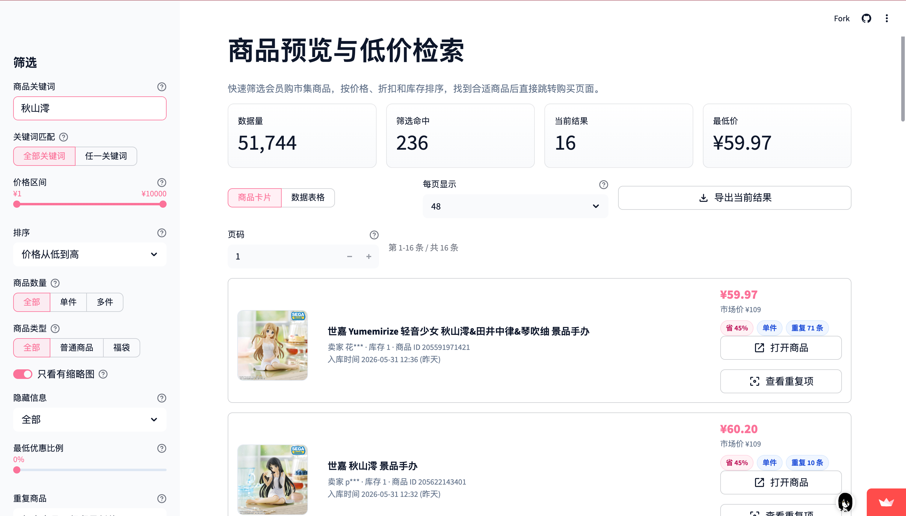

# **bilibili-mall**

一个用于浏览、检索和比较 B 站会员购市集商品的小工具。

B 站会员购市集目前不支持按商品名称搜索，只能不断下滑刷新，等待新的商品推荐出现。对想淘某个特定商品的人来说，这很容易变成一件靠耐心和运气的事：第一次刷到的价格未必是最低价，很多时候只是一个中间价；如果刚下单不久又在后面刷到更便宜的同款，就很难受。

这个项目把「反复手动刷新」变成「先收集，再检索」：用自己的登录 Cookie 以较保守的节奏同步市集列表，再通过 Streamlit 页面按关键词、价格、折扣和库存快速筛选，帮助你更理性地比较价格。

## 相关入口

- 在线应用：[https://bilibili-mall.streamlit.app/](https://bilibili-mall.streamlit.app/)
- 会员购市集：[https://mall.bilibili.com/neul-next/index.html?page=magic-market_index](https://mall.bilibili.com/neul-next/index.html?page=magic-market_index)
- 手办厂商信息：[https://www.hpoi.net/index/home](https://www.hpoi.net/index/home)

## 主要功能

- 商品检索：按标题、明细商品名和卖家名搜索，支持多个关键词组合。
- 价格与折扣筛选：按价格区间、优惠比例、商品数量、商品类型等条件过滤。
- 重复商品整理：同一商品可以只看最低价，也可以保留多个低价结果用于比较；如果只想看某一件商品，也可以直接聚焦查看它的重复项。
- 两种浏览方式：商品卡片适合快速扫图，表格模式适合集中查看字段和链接。
- 数据新鲜度：页面会显示商品入库时间，方便判断当前数据是否已经刷新。
- 结果导出：把当前筛选结果导出为 CSV，方便后续整理。
- 自动更新数据：可以通过 GitHub Actions 定时刷新数据，也可以手动触发。
- 本地抓取：需要时可以在本地打开爬虫面板，使用自己的 Cookie 更新数据。

## 应用预览



> [!IMPORTANT]
> 抓取会员购市集需要你自己的访问 Cookie。Cookie 属于敏感登录凭据，请只放在本机环境变量、Streamlit secrets 或 GitHub repository secrets 中，不要提交到仓库，也不要分享给他人。Cookie 可以从上面的会员购市集页面请求中获取。

## 快速开始

安装依赖：

```bash
uv sync
```

启动页面：

```bash
uv run streamlit run streamlit_app.py
```

指定端口启动：

```bash
uv run streamlit run streamlit_app.py --server.port 8501
```

如果已经配置了远程数据源，页面会直接加载最新数据；如果没有远程数据源，也可以在本地使用爬虫面板更新数据。

## 数据更新

当前推荐的更新方式是使用 GitHub Actions：

- 每天 UTC+8 08:00 自动运行一次，默认清空旧数据并重新抓取当前市集数据。
- 也可以在 GitHub Actions 页面手动运行，默认同样从零重建数据。
- 手动运行时可以按价格区间勾选抓取范围，例如只抓取 `100 - 200 元` 和 `200 元以上`。
- 如果手动运行只勾选部分价格区间，本次发布的数据也只包含这些区间；下一次定时任务会恢复全量数据。
- Cookie 存放在 repository secret `BMALL_COOKIE` 中。
- 更新完成后，Streamlit 页面读取最新发布的数据。

市集接口依赖登录态，抓取也需要控制请求节奏。因此自动更新默认按单进程方式运行，避免多个任务同时使用同一个账号状态。

详细部署步骤见 [DEPLOY.md](DEPLOY.md)。

## 常用环境变量

| 配置 | 用途 |
| --- | --- |
| `BMALL_DATA_URL` | Streamlit 页面读取的远程数据地址 |
| `BMALL_COOKIE` | 爬虫使用的会员购访问 Cookie |
| `BMALL_PROXY` | GitHub Actions 或部署环境中的可选代理 |
| `HTTP_PROXY` / `HTTPS_PROXY` | 通用代理环境变量 |
| `BMALL_DATA_RETENTION_DAYS` | 自动更新数据的保留天数，默认 15 天 |
| `BMALL_ENABLE_CRAWLER_PANEL` | 是否在 Streamlit 页面显示本地爬虫面板，默认关闭 |

公开部署时建议只开启市场预览页面，不开放在线爬虫控制面板。

## 本地爬虫

本地调试时可以开启爬虫面板：

```bash
BMALL_ENABLE_CRAWLER_PANEL=true uv run streamlit run streamlit_app.py
```

面板里可以配置 Cookie、代理、抓取范围、请求间隔和失败重试。爬虫支持暂停、继续和断点续爬。

也可以直接运行自动更新脚本：

```bash
BMALL_COOKIE='SESSDATA=...; bili_jct=...; DedeUserID=...' \
uv run python -m scripts.crawl_bmall_data
```

## 开发

运行测试：

```bash
uv run python -m unittest discover -s tests
```

常用入口：

- [streamlit_app.py](streamlit_app.py)：市场预览与检索页面。
- [scripts/crawl_bmall_data.py](scripts/crawl_bmall_data.py)：GitHub Actions 使用的数据更新入口。
- [DEPLOY.md](DEPLOY.md)：部署与定时更新说明。
- [API.md](API.md)：会员购市集页面和接口的观察记录。

## 说明

这个项目不是 B 站官方工具，只是为了更方便地浏览会员购市集公开列表。请合理控制抓取频率，并自行保管账号凭据。
